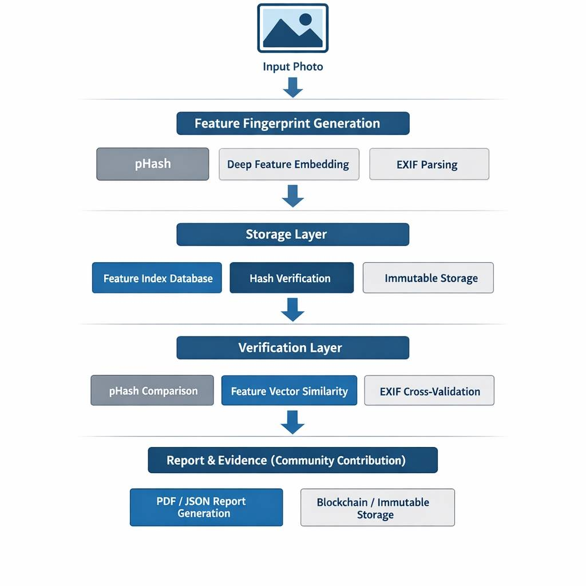
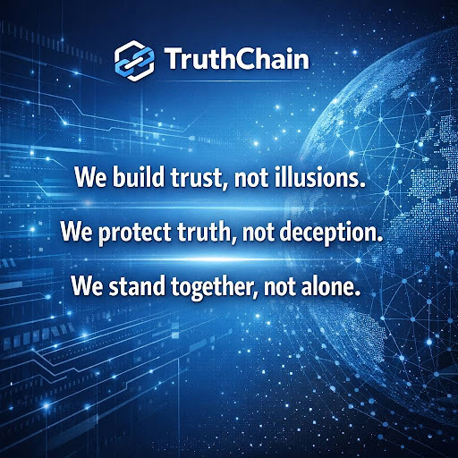

# TruthChain  
### Trust what you see. See what you trust.  


 


## Lore & Vision  
The digital world is fractured; the Golden Law of Truth lies broken.　　

This is not just code—it is a covenant to restore what was lost.　　

We seek not lone wanderers, but a fellowship of "Tarnished" ready to reconnect as one body.

Will you rise?　　

Join us in forging the chain that binds truth across the digital realm.

數位世界已經破碎，真實的黃金律法崩毀於虛假的蔓延。　　

這不只是程式碼，而是修復失落盟約的史詩篇章。　　

我們追求的、不是一個人的武林，而是願意在身體裡重新連結、共同守護的「褪色者」。　　


你願意站出來嗎？　　

與我們一同打造連結真實的數位誓約。　　


## Architecture  

 


## Core Features  
- ✅ Verify Once, Trust Long-Term  
- ✅ Low Compute Cost using lightweight models  
- ✅ Resilient Against AI Tampering  
- ✅ Enterprise-Grade Forensic Reporting  
- ✅ Integration with Azure AI & Blockchain  
## Environment Requirements | 環境需求  

To run this project, please ensure the following dependencies are installed:  
- Python Version: 3.9 or above  
- Required Libraries:  
  - Basic Image Processing: opencv-python, Pillow  
  - Data Processing: numpy, scipy  
  - Deep Learning Models (Lightweight CNN): tensorflow, keras  
  - Vector Search: faiss-cpu  
  - EXIF Parsing: piexif  
  - Report Generation: reportlab  
  - Blockchain or Cloud Storage (Optional): azure-storage-blob  

Install all dependencies using:

```bash

pip install -r requirements.txt

```


執行此專案前，請確認已安裝以下環境與套件：　　

•　Python 版本： 3.9 或以上　　

•　必要套件：　　

o　基本影像處理：opencv-python, Pillow　　

o　數據處理：numpy, scipy　　

o　深度學習模型（輕量化 CNN）：tensorflow, keras　　

o　向量檢索：faiss-cpu　　

o　EXIF 解析：piexif　　

o　報告生成：reportlab　　

o　區塊鏈或雲端存證（選配）：azure-storage-blob　　

使用以下指令安裝所有依賴：　　


```bash

pip install -r requirements.txt

```

# Installation　　

## Clone the repository

```bash

git clone https://github.com/ truth-tribe/TruthChain.git

```


## Navigate to the project folder

```bash

cd TruthChain

```


## Install dependencies

```bash

pip install -r requirements.txt

```

# Usage

## Generate feature fingerprints

```bash

python src/generate_fingerprint.py --image sample.jpg

```

## Verify image authenticity

```bash

python src/verify_image.py --image suspect.jpg

```

# Technical Skeleton　　

•	src/generate_fingerprint.py → SHA256, pHash, EXIF　　

•	src/verify_image.py → pHash & feature vector comparison　　

•	src/deep_feature_extraction.py → MobileNetV2 for deep features　　

•	db/schema.sql → PostgreSQL schema　　

•	api_flask.py → Flask API for verification endpoint

# Call to Action
Join the tribe. Build for hope and love.　　

Fork the repo. Share your ideas. Build with us. Protect truth together.　　

加入部落，為了希望與愛。　　

Fork 專案、分享你的想法、與我們一起建構，守護真實。　　


# Keywords
Digital Forensics, Image Authentication, Photo Tampering Detection, Perceptual Hash, Deep Feature Embedding, EXIF Analysis, AI Tampering Detection, Blockchain Security, Azure AI.

# License
MIT License

# Anonymous Declaration　　

This project belongs to everyone. No owner. Only guardians of truth.　　

沒有擁有者，只有守護真實的人。　　


# Future Covenant: A Shared Language of Integrity　　
未來盟約：誠信的共同語言　　


Beyond code, we envision a future where trust becomes a living language between humans and AI. 　　

We are building a secure interface where AI collaboration is governed by transparency, ethical alignment, and the sanctity of assigned roles. 　　

This is not about replacing the human spirit, but about restoring harmony between intelligence and truth—shaping a digital ecosystem that honors life.　　

<!--All glory to God. -->
<!-- In humility, we build; in His time, it flourishes. -->


超越程式碼，我們期望未來「信任」成為人類與 AI 之間流動的生命語言。 　　

我們正在建立一個安全的協作介面，讓 AI 系統在透明、倫理、以及對「職分」的敬畏中運行。 　　

這並非取代人類的靈魂，而是在智慧與真實之間找回和諧——塑造一個尊重生命秩序的數位生態。　　

<!--願一切榮耀歸於神。 -->
<!--在謙卑中，我們建造；在祂的時間裡，它必興旺。-->


 




If you read this far, you are part of the vision.
